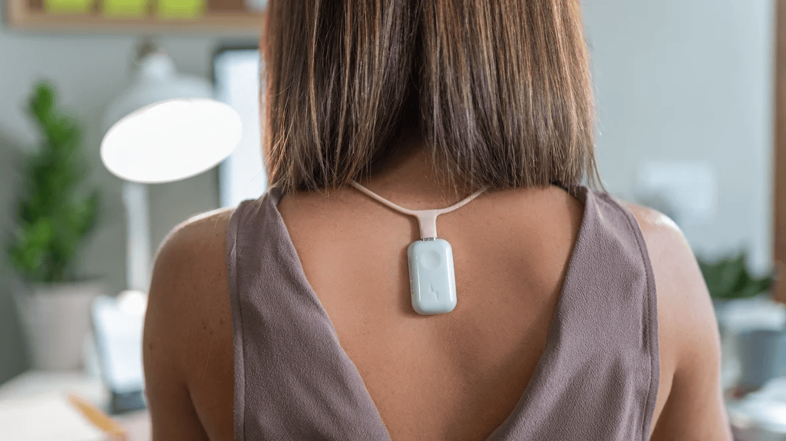

# Process Journal
<b>Class:</b> DES220  
<b>Assignment:</b> Tasks 2 and 3  
<b>Group:</b> Individual  
<b>Member:</b> Ryan Wells

# 1 Introduction

This process journal will be documenting the design and creation of a project for tasks 2 and 3 in DES220. The project itself will be a responsive, and physical creation that will use a microcontroller (such as a Raspberry Pi, ESP32, or a Micro:Bit). This assignment has the option to be developed in a group of up to 3 people, however I have decided to develop this solution myself, so that I can challenge myself while also having complete creative control.

A fundamental attribute my solution must meet is that it must be Responsive. Responsive in this context refers to the dynamic reaction of a system that responds to external stimuli. An example of this is an individual wearing a smartwatch with a built-in heart monitor. The Input is the user's heart rate, and the response is a graphical display of the user's real-time heart rate. The solution for this assignment doesn’t need to be a wearable device; it can be anything from custom hardware to environmental sensors fed into a web application. 

## 1.1 Workshop Design Practice

Throughout this course, several key design areas are identified to increase design focus and productivity. These aspects identify the <b>Form</b>, <b>Interaction Configuration</b>, <b>What Input is Being Responded to?</b>, and <b>What kind of output does it respond with?</b>

A provided tool to help develop my brainstorming skills was the 'Responsive Roulette' tool in Week 6's Workshop (https://tgifford-usc.github.io/ResponsiveRoulette/). This tool generates several random answers for the different design aspects mentioned above. I was tasked with creating a 'solution' for this random combination to help me learn to think outside the box. The generated prompts I was given were the following.
 

### Generation #1

<b>Form:</b> Mobile App 
<b>Interaction Configuration:</b> Multiperson 
<b>What Input is being responded to?</b> Location 
<b>What kind of output does it respond with?</b> Visual

An idea for this is a hide-and-seek mobile application that hiders install to see where the other hiders are hiding and where the seeker is. Of course, everyone's location would be tracked using the app, and their location would be displayed using a generic map API like Google Maps, with hiders’ locations marked with a blue pin, and the seeker in red.

### Generation #2

<b>Form:</b> Hybrid 
<b>Interaction Configuration:</b> Non-Human 
<b>What Input is being responded to?</b> Environmental Sensors 
<b>What kind of output does it respond with?</b> Kinetic

This generation is inherently more complex than the last generation. An idea for this generation is a robot that is programmed to move in a straight line until one of its sensors detects an object in its way. Upon this detection, it will turn to avoid contact. The robot can also transmit its sensor data to a web application so that (A) the robot can refer to its detection history, and (B) a human can observe and track its movement.

## 1.2 Potential Ideas for Project

Ideally, the project I develop for this assignment will solve a problem that I personally experience. The solution doesn’t need to reinvent the wheel, but it does need to have my own unique twist that makes it unique. The following are potential solutions I have come up with that could be interesting to further develop. 
  
<b>(1) Smart Home Device</b>  As I have a smart home setup already established with Home Assistant, my first thought is to create a smart device that can link into that already established infrastructure. However, this solution will be complicated to develop and integrate—especially for the shorter time frame for this project. In addition, it poses difficulty actually demonstrating this project in class as there is no infrastructure established at the university. Because of this, if this solution is pursued it would require a self-contained feature set that exists outside the Home Assistant environment for demonstration purposes, which may be outside of the scope of this project.  
<b>(2) Posture Tracker</b> 
Another idea I’ve been playing with in my head is a mobile web application that uses a phone's built-in accelerometer and gyroscope to determine if the user is slouching over and has bad posture. This premise is simple in prospect, which makes it more feasible for this assignment. The biggest issue I see with this idea is simply the fact that 90% of the time a phone is placed into the pants of an individual. This would mean that the accelerometer would be inaccurate in displaying the angle of a user's posture. Therefore, if this idea is pursued it may be necessary to create a dedicated gyroscope attachment a user places onto their shirt for more accurate tracking.  
<b>(3) Hide and Seek Application</b> The Hide and Seek solution brainstormed previously could be a good option, because of its simpler premise. This solution would be self-contained, as it doesn’t require any existing infrastructure to work—like with the Home Assistant smart device.  
<b>(4) Video Responsive RGB Strip</b> One of the coolest uses of LED's I’ve ever seen is placing an LED strip behind a TV and having the LED's mimic the color on the TV. This project would undoubtedly be large in scale—especially since commercial releases of this concept can easily exceed $500 AUD. This prospect would require live video analysis of a display which may be more than a Micro:Bit or ESP32 can handle. More research into this concept in particular is useful since there are many unknowns that need to be cleared up before a final decision can be made. 

## 1.3 Pros and Cons

To help narrow down what this assignment should focus on, I'll do a pros and cons list for each item mentioned as a potential idea.

### Smart Home Device
- Pros
    - It's Awesome. Something that I would use all the time and would encourage me to dive outside my comfort zone 
    - Existing Infrastructure. Takes advantage of pre-existing infrastructure which makes this prospect a niche opportunity 

- Cons
    - Complicated. Would take significantly longer to develop 
    - Cost. Expensive depending on materials required to build solution

### Posture Tracker
- Pros
    - Simple. Significantly lower scope, so more feasible to complete under short development period 
    - Solves a problem. As I personally have low posture, this prospect would assist me in efforts to correct my posture
    - Cheap. Would require significantly fewer resources compared to other projects mentioned. 

- Cons
    - Not as challenging. For this project, I want to challenge myself with something I haven't done before.

### Hide and Seek Application
- Pros
    - Fun. The end goal for this project would be really enjoyable 
    - Challenging. As this project would require several devices communicating with each other, which fulfills my request for a challenging project, without being potentially overbearing like the Smart Home Device 

- Cons
    - Very Niche. This project, when completed, could only be used when playing hide and seek. This in some ways defeats the goal of solving a problem I often face

### Video Responsive RGB Strip
- Pros
    - It's Awesome. Something that I would use all the time and would encourage me to dive outside my comfort zone 

- Cons
    - Cost. RGB strip would be very expensive, especially getting enough to go around a TV
    - Already Developed. This prospect already exists in a commercial setting, which considering how complicated this would be, defeats the point in my eyes
    - Very Complicated. This project would be the most complicated to develop out of this list, and would be infeasible for the scope of this assignment.

## 1.4 Selection

After analysing the Pros and Cons list above, I believe the best option for this assignment is the <b>Posture Tracker</b>. This is for several reasons. Firstly, it was the option with the most pros and least cons. That instantly got my attention as this project needs to be a good compromise between what the assignment is asking of me, and what I want my project to be. Despite the simpler prospect, I believe there is still plenty of depth to be seen here. Specifically, in terms of the external device that would need to be created to 
accurately read a user's posture level in order for the solution to still meet the task's criteria of being 'responsive'.

# 2 Research
This section of my process journal will focus on the research for this project. Those include, but are not limited to - the technological, material, programming, time, and economical considerations. As I have mentioned several times in this process journal, the scope of this project is very important—so that it can be completed in time for its due date. But even with the simpler premise of the <b>Posture Tracker</b>, it's still very possible to over-complicate things which would void the advantage of choosing a simpler premise.

This research segment will double as not just documentation - but as a way to record what other devices have done and see what already works; and to determine whether or not they are worth looking further into to ensure the end result doesn't get too crazy.

## 2.1 What is Posture?
In order to properly develop a solution geared to improving posture, it is crucial to understand <b><i>what posture is</b></i>. According to scholars Luis and Rosario, posture is defined as the stabilizing of the joints of the skeletal system through coordinated interaction of skeletal muscles, which maintain body segments in alignment against gravity and serve as the basis for movement and non-verbal communication.

Luis and Rosario also emphasis that simply 'standing up straight' isn't the only way to improve posture. A mixture of different approaches will assist, including:  
- <b>Excercise and Re-Education:</b> Specific exercises to strengthen weak muscles, stretch tight ones, and retrain movement patterns. This helps create lasting postural correction. 
- <b>Manual Therapies:</b> Chiropractic, osteopathy, and other hands-on approaches may help by correcting joint misalignments and improving mobility — but they must be combined with exercise to hold the benefits.
- <b>Awareness and Habits:</b> Learning to be aware of body position and developing new motor patterns is essential for long-term improvement.
- <b>Fascia and Muscle Chains:</b> Training that engages whole myofascial chains (not just isolated muscles) helps sustain better alignment.
- <b>Holistic Factors: </b>Psychological state, fatigue, and even footwear can influence posture — so improvement requires addressing lifestyle and emotional factors too.

A lot of these approaches are geared towards recovery which is beyond the intention of this device - which intends to simply correct posture. Because of this scope, it won't be aiming to replace <b>Manual Therapies</b>, or <b>Holistic Factors</b>, as they are done by medical professionals. Instead, simply aiming to train the user and their muscles in more in-line with what this device can do. As a result, <b>Excercise and Re-Education</b>, <b>Awareness and Habits</b>, and <b>Fascia and Muscle Chains</b> are going to be the main focus area's going forward.

In other words, this device is simply going to make the user aware when they have bad posture - show them what good posture <i>is</i> and therefore train the user into making healthy habbits.

## 2.2 Similar Existing Projects
To get a better idea of how to create a device that measures a user's posture, doing research into similar products can be a great way to determine what works, what doesn't, and the different approaches that exist. The following 3 products are the most interesting consumer-grade products I've seen that match the spirit of the solution I'm trying to make. 

### Upright GO 2
The Upright Go 2 is a small, lightweight sensor that attaches to your upper back using an adhesive strip. It detects the angle of your spine and shoulders, and when you start slouching, it gives a gentle vibration reminder. Pairs with a smartphone app to log posture data throughout the day. This specific product highlights the obtrusiveness such a product can have. Ideally, a product that does this while being less visible is ideal, otherwise it may become 'embarrasing' for the user to wear in public.
  

### Lumo Lift
The Lumo Lift is similar to the Upright Go 2, where it is a clip-on device worn near the collarbone, usually held in place by a magnetic clasp. It monitors chest and shoulder alignment, buzzing if you lean forward or hunch. Data syncs with an app to track long-term posture habits and improvements. Note that in the image below, it is significantly smaller than the Upright GO 2.
  

### Zikto Walk
Out of the three devices listed, the Zikto Walk is definitely the most unique. It is a fitness-style wristband that tracks arm swing and overall body balance while walking. By analyzing walking patterns and body movement, it estimates posture alignment and suggests improvements via a connected app. Arguably the most advanced product as it doesn't measure the back's alignment directly. This solution is also more socially accepted since smart wrist devices (like smart watches, and FitBits) are already worn by a large population.
  

 

It's reassuring to know that so many varied solutions for a posture analyser exist, and that I dont have to completely start from scratch. These distinct products are all trying to achieve the same goal but through various means. But for the purposes of my solution, I want a device that is as compact as possible while also being as user-friendly to use (and wear) as possible, while being visually aesthetic. For this reason, I would steer clear of the more visually hostile implementation found with the Upright GO 2, allthough I did like the dedicated holder the Upright GO 2 has for keeping the gyroscope in place, compared to the magnets found in the Lumo Lift. A good blend between the Lumo Lift's more minimalistic device and the Upright GO's neck-brace could work quite well. 

While I do like idea of the Zikto Walk, I don't think a wearable wrist device would be viable given the constraints of this project. The main thing that concerns me are that the microcomputer's available to me (ESP32, Micro:Bit, etc) are quite large. When concidering other aspects like the battery, wiring, etc, it is unlikely that a solution could be made that is easy to use and visually aesthetic. Whereas with the conventional approach I had in mind where a sensor is applied to the user's body, it is more feasable to hide certain components under the shirt of the user. There is also the barrier of development. As mentioned previously, a wearable wrist device like the Zikto Walk would be significantly harder to develop for since I would need to determine how the user's arm swings related to the user's posture, which would require significantly more R&D then I have the ability to. 

# 3 Design

## 3.1 Material Considerations
The main obstacle I foresee with this project is the size of the individual components. Since I'm limited to off-the-shelf parts, that means that I won't be able to create a single compact device that includes the main elements - such as the micro-computer, battery, wiring, sensors, etc. For the purposes of cost/time efficiency, I am going to focus on materials and technology that I have access to and/or experience with.  

### Micro Controller
The heart of this project. The micro controller will calculate if the current alignment of the user's back is straight based on a gyroscopic sensor.  The main two options available for this project are the Micro:Bit V2's, and ESP32's.

#### Micro:Bit
Last semester in DES221, the use of micro:bits was a fundamental aspect of that course. As a result, I not only have one purchased from that course, but I also have the knowledge to develop using it. Using that micro:bit would of course eliminate cost, but more importantly shorten development time since I won't need to learn how to use a Micro:Bit. The Micro:Bit V2 additionally contains a built-in 3-axis accelerometer. It can measure tilt, pitch and roll. However, it does not have a gyroscope. Relying purely on an accelerometer means that if the user is moving (walking and especially running), the data can very quickly become noisy and unreadable. To avoid this would require an additional IMU (Inertial Measurement Unit), which can include <b>both</b> a gyroscope and accelerometer - effectively eliminating that advantage. A Micro:Bit is also limited in what it can do. The Micro:Bit V2 does not have any Wi-Fi or Bluetooth capabilities and is lacking in computing power.

#### ESP32
The ESP32 is the micro controller recommended for this course, and has benefits when compared to the Micro:Bit V2. It has built-in Wi-Fi and Bluetooth, and is significantly more powerful than the Micro:Bit V2. While I don't actively have experience working with ESP32's, I have direct access to several thanks to a bulk purchase I made a while ago. For me, this means that I have the option to use multiple ESP32's, even if that is unlikely. Unfortunately, the ESP32 doesn't contain either a gyroscope or an accelerometer. Therefore, the use of an external IMU will be necessary if an ESP32 is chosen for the project. Additionally, I have never used an ESP32 before, so developing for it will inherently be more complicated (especially since ESP32's have a more complicated IDE inherently). However, this has the side-effect of increasing the challenge of this project which was an attribute I was concerned about when choosing what project to pursue earlier in this project journal.

### Sensors
As mentioned when talking about the micro controllers, an IMU (Inertial Measurement Unit) will be critical for actually knowing the relative state of the user's posture. The following sensors were the most feasible sensors I've found that can be used with both a Micro:Bit V2 and an ESP32 (although, easier to set up with ESP32).

#### MPU-6050
- 3-axis accelerometer + 3-axis gyroscope  
- Very Cheap  
- Simple to use  
- Good for basic tilt/posture detection  

#### MPU-6886
- 3-axis accelerometer + 3-axis gyroscope  
- Small Size  
- Low Power  
- Slightly better performance and lower noise than MPU-6050  

#### ICM-20948
- 3-axis accelerometer + 3-axis gyroscope + 3-axis magnetometer  
- Low noise  
- More expensive than MPU-6050 and MPU-6886  
- More setup required  
- Allows for more precise measurements  

### Battery
An ESP32 typically operates between 3.3V - 3.6V, with power consumption varying based on usage. Whereas a Micro:Bit requires a stable 3V input. Both of the following batteries are part of the 'Lithium' family, and depending on the specific mAh of the battery, can be used for both Micro:Bit V2 and ESP32's.

#### Li-ion (Lithium Ion) Batteries
- Family of rechargeable lithium-based cells (different chemistries exist).  
- Often found in rigid cylindrical or prismatic cases.  
- Typically high energy density (Wh/kg), but exact value depends on the chemistry.  
- Mechanically robust and less likely to show visible swelling than pouch cells.  
- Require proper charging and protection  
- Vulnerable to overcharge, short, heat or puncture.  

#### Single Cell LiPo (Lithium Polymer) Batteries
- A pouch (soft-pack) style of lithium cell (still part of the lithium-ion family).  
- Uses a polymer pouch construction  
- Electrolyte inside LiPo batteries may be gel-like or liquid contained in the pouch.  
- Compact, flat/rectangular and lightweight.  
- Energy density is comparable to other Li-ion cells (sometimes slightly lower depending on chemistry).  
- More prone to visible swelling and mechanically fragile.  
- Needs proper charging and protection.  

## Vibration Motors
In order for this device to be considered 'responsive', it needs to not only react to stimuli, but also have a reaction to that stimuli. Vibration motors make the most sense, as the user needs immediate correction if their posture gets bad.

#### Seeed Mini Vibration Motor
- Compact size, coin/flat type  
- Voltage: 3 V (works from ~2–3.6 V)  
- Produces a light to moderate vibration  
- Needs a transistor/MOSFET when controlled by an ESP32  

#### 10 mm Cylindrical Vibrator Module
- Voltage: 3 V–5 V  
- Higher vibration strength compared to coin motors of similar size  
- Slightly bulkier than coin motors  
- Needs a transistor/MOSFET when controlled by an ESP32  

### General Materials
In this context, when I say general materials, I'm referring to the materials used for the construction of the device itself. These can include, but are not limited to:

#### Micro Controller Attachment Material
Both <b>Velcro</b> and <b>Magnets</b> are the obvious choices for attaching the device to the user. They are seen on the Upright GO 2 and the Lumo Lift respectively, and are a cheap, lightweight solution for attachment. A final decision can't be made at this stage regarding the use of either, as further testing will conclude how each material fares in terms of wearability and strength. However, I have a keen interest in magnets, as that will allow for more modularity, and a more minimalistic appearance. Additionally, a rubber band will be used to wrap around the user's torso to hold the micro controller, battery, and vibration motor.

#### Case Material
The actual case will consist of the structure designed to hold the various components that comprise the final device the user will wear. For this case, the following materials are the most realistic options for developing this project with. The final design may or may not use a combination of all of these, however the primary case material will be made with one of the following:  

- 3D Printed Plastic  
  - Pros  
    - Accessible through university  
    - Durable  
    - Cheap  
    - Have used before in previous DES221 project  
  - Cons  
    - Can't make last-minute additions at home  

- Timber  
  - Pros  
    - Durable  
    - Ability to construct at home  
  - Cons  
    - Heavy  
    - Expensive  

- Cardboard  
  - Pros  
    - Very Cheap  
    - Efficient to create with  
  - Cons  
    - Very Weak  
    - May not be structurally sound enough to hold other components  

### Material Choices
Throughout the process of writing down the materials in this process journal, I have been determining what would work well for my proposed device. Given the nature of the device, in that its purpose is to measure the posture of its wearer. Because of this, I have concluded that more advanced components would suit not just the scope of this project, but fulfill my desire for a challenge as well.

#### Micro Controller - ESP32
For the micro controller, the <b>ESP32</b> seems to be the best choice for this project, as it's more powerful and has built-in communication chips. Honestly, both micro controllers can work for this project - however the fact that I don't know how to use an ESP32 is why I want to pursue this further.

#### Sensor - MPU-6886 or MPU-6050
For the sensor, both the <b>MPU-6886</b> and the <b>MPU-6050</b> are so similar that either one could work for this device. This is because they are both affordable, and work well natively with an ESP32. However, preferably, I would choose an MPU-6886, simply because it's slightly more advanced and reduces its random noise in its reading.

#### Battery - LiPo (Lithium Polymer) Battery
The LiPo battery will suit this project better, as it's slim, affordable, and lightweight. Additionally, it has energy density on par with other lithium-based options. But primarily, it's shape will make it easier to attach comfortably to the user.

#### Vibration Motor - 10 mm Cylindrical Vibrator Module
As mentioned several times over this process journal, the final solution needs to be as minimalistic and functional as possible. The 10 mm Cylindrical Vibrator Module can achieve this by having a stronger vibration compared to other options whilst still being a smaller size. This ensures the wearer can feel the vibration when their posture has slouched, without feeling any unnecessary weight in addition to what the final solution will already weigh.

#### Case Material - 3D Printing
3D printing is very much the obvious choice for this device. It's affordable, lightweight, durable and is readily available at the university.

## 3.2 Prototype Sketches
Below are some proposed prototype sketches, made using the materials decided previously.

### Prototype Sketch 1

With this first initial design, I wanted to go for something simular to the existing solutions i've seen. Specifically, I really liked how the Lumo Lift had the sensor rest under the shirt near the neck. I have done something simular here, with the MPU-6886 sensor being seperate from the elastic band the user is wearing around his chest. Doing this, will reduce the stress on the shirt had all the components been placed at the same spot as the sensor, as well as making it less top heavy for the user. The sensor will be held up with a clip that clings to the user's collar. Additionally, an elastic band has been placed around the user's chest that contains the micro controller, battery and vibration module. Each component will have a custom 3D printed container, as that will help protect these sensitive components, as well as allow velcro to be easily applied. Velcro is also applied to the elastic band as well, so that these components can be easily detached for whatever reason. The ESP32 is placed at the center (the yellow module) so that it has a clear connection to the other components as well. 

### Prototype Sketch 2
 
This design is very simular to the first one, except with this one there are 2 major changes. Firstly, the elastic band has been moved up above the gut. This was done, because after reflecting on the original design, it occured that having the band wrap around the chest could cause difficulty breathing - especially if the user is particularly active. Secondly, the clip at the collar has been replaced for duel magnets that rest perpendicular to the MPU-6886 sensor. This change was made for 2 reasons. Aesthetics - avoiding an ugly pin pertruding at the top of the collar, and Grip - 2 perpendicular magnets will allow for finer adjustments from the user, whilst providing more strength then a single clip. As a result of this increased strength, the user in theory should be able to be more active with this device on without it coming off as easily.

# 4 Development
(No current development at this time)

## 4.1 Final Sketches
(No current development at this time)

## 4.2 Code
(No current development at this time)

## 4.3 Construction
(No current development at this time)

## 4.4 Finished Device
(No current development at this time)

# 5 Testing
(No current testing at this time)

## 5.1 Functionality Test
(No current testing at this time)

# References
Luis, J., & Rosario, J. (2017). What is Posture? A Review of the Literature in Search of a Definition. https://ecronicon.net/assets/ecor/pdf/ECOR-06-00168.pdf